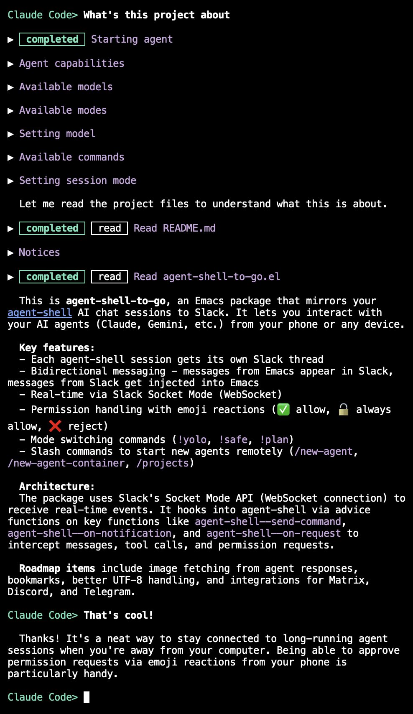
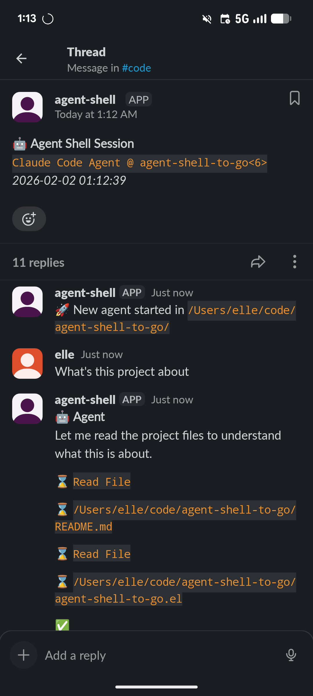
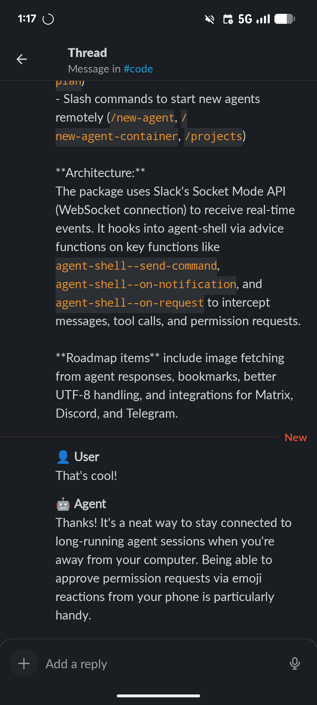

# agent-shell-to-go

> Forked from [ElleNajt's repo](https://github.com/ElleNajt/agent-shell-to-go). The development of the original package has been dropped and replaced by a more generic ACP multiplexer (one agent connecting to multiple clients) and dedicated frontends.

> I believe that an agent-shell specific tool that enable remote agent control is still valuable since
> - I do not have a use case where I want to control the agent from both emacs and remote at the same time, so a proper multiplexer and a dedicated frontend sounds an overkill to me.
> - My agent-specific config (launch flags, plugins, MCP, environment variables) are all set in emacs and agent-shell. Maintaining a separate configuration for a different agent feels repeatitive.

Take your [agent-shell](https://github.com/xenodium/agent-shell) sessions anywhere. Chat with your AI agents from your phone or any device.

| Emacs | Slack (message from phone) | Slack (follow-up from Emacs) |
|-------|---------------------------|------------------------------|
|  |  |  |

## Overview

agent-shell-to-go mirrors your agent-shell conversations to external messaging platforms, enabling bidirectional communication. Send messages from your phone, approve permissions on the go, and monitor your AI agents from anywhere.

Currently supported:
- **Slack** (via Socket Mode)
- **Discord** (via Discord Gateway)

Planned/possible integrations:
- Matrix
- Telegram

## Features

- **Per-project channels** - each project gets its own channel automatically
    - Each agent-shell session gets its own thread within the project channel
    - Messages flow bidirectionally (Emacs ↔ messaging platform)
    - Real-time updates via WebSocket
- **Message queuing** - messages sent while the agent is busy are queued and processed automatically
    - Permission requests with reaction-based approval
    - Mode switching via commands (`!yolo`, `!safe`, `!plan`)
    - Start new agents remotely via slash commands
- **Error forwarding** - agent startup failures and API errors are automatically reported to the thread
    - Works with any agent-shell agent (Claude Code, Gemini, etc.)

## Setup

- [Slack setup](docs/slack-setup.md) — app creation, credentials, usage, reactions, troubleshooting
- [Discord setup](docs/discord-bot-setup.md) — bot creation, permissions, forum channels, custom emojis

## Roadmap

- [x] Better UTF-8 and unicode handling (now uses curl)
- [x] Per-project channels - each project gets its own Slack channel automatically
- [x] Message queuing - messages sent while agent is busy are queued automatically
- [x] Three-state message expansion - collapsed (icon only), glance (👀, ~500 chars), full read (📖)
- [x] Discord integration
- [ ] Cloudflare Worker relay - Slack's Socket Mode requires your laptop to be online; when it sleeps or loses WiFi, Slack accumulates delivery failures and eventually disables the app. A Cloudflare Worker relay would maintain the Slack Socket Mode connection 24/7, queue messages while you're offline, and forward them when Emacs reconnects.
- [ ] Matrix integration
- [ ] Telegram integration

## Related Projects

**Pairs well with [meta-agent-shell](https://github.com/ElleNajt/meta-agent-shell)** - A supervisory agent that monitors all your sessions. Search across agents, send messages between them, and manage your fleet of AI agents from Slack.

## License

GPL-3.0
